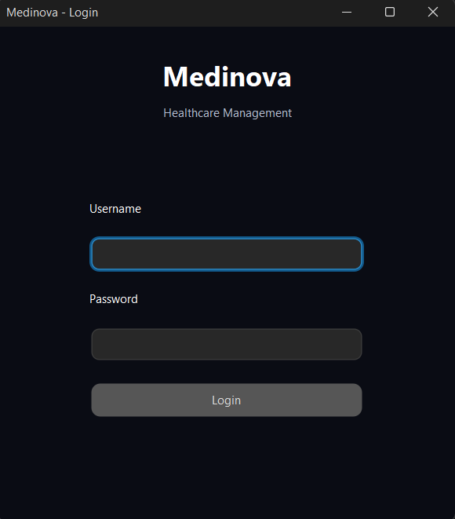
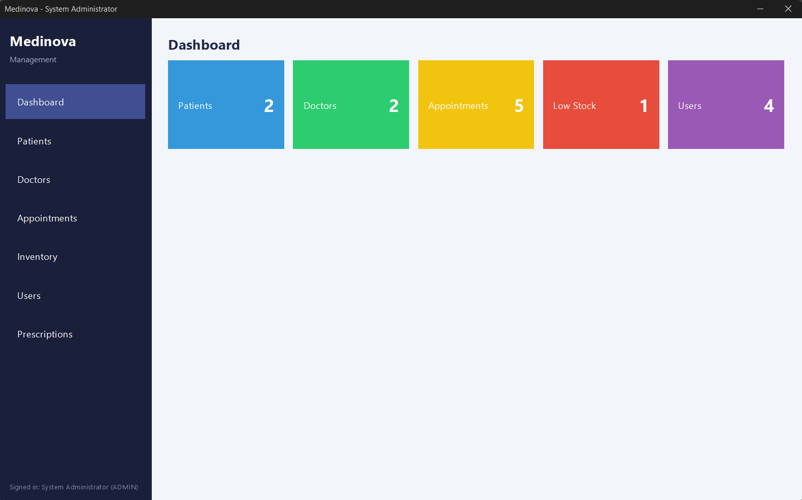
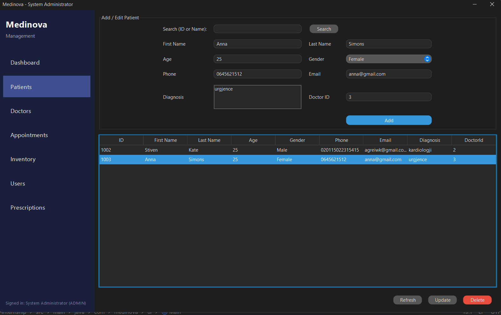
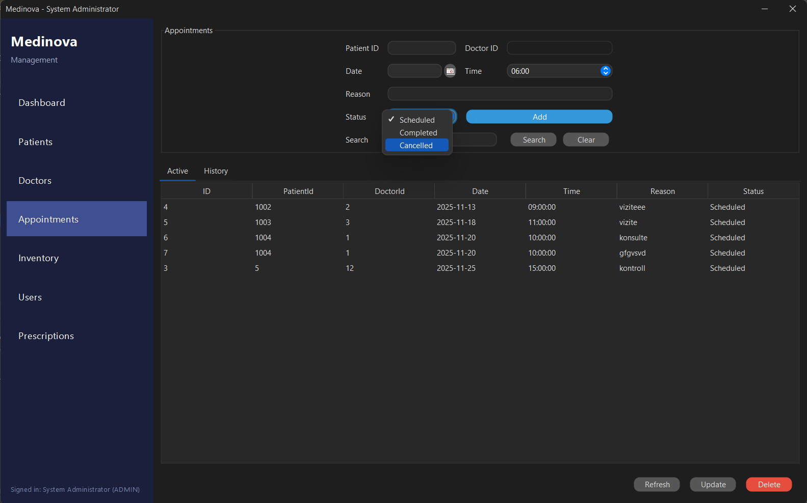
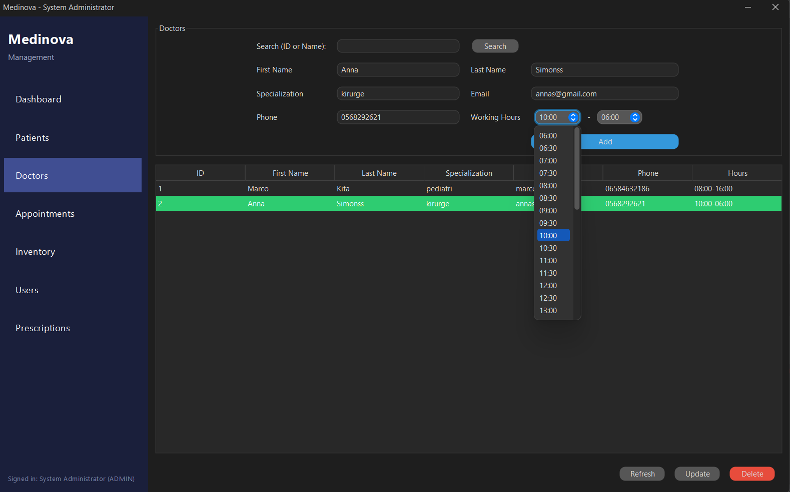

# 🏥 Medinova Healthcare Management System

A **Java Swing & SQL Server** based desktop application designed to manage healthcare operations efficiently.  
This system provides a complete solution for handling patients, doctors, appointments, inventory, and user roles.

---

## 🚀 Features

- 👤 User Management (Admin & Receptionist roles)
- 🧑‍⚕️ Doctor Management
- 🧾 Patient Registration & Management
- 📅 Appointment Scheduling
- 💊 Prescription Handling
- 📦 Medical Inventory Management
- 📊 Dashboard Overview

---

## 🛠️ Technologies Used

- Java (Swing)
- JDBC
- SQL Server
- Maven

---

## 🧠 Architecture

The project follows a **layered architecture**:

com.medinova
│
├── dao → Data Access Layer (Database operations)
├── model → Entities & Enums
├── database → Database connection
└── ui → User Interface (Swing)

---

## 🗄️ Database Setup

1. Open SQL Server
2. Create a new database (e.g. `DBMedinova`)
3. Run the script located at:

db/schema.sql

---

## ▶️ How to Run

1. Clone the repository:

git clone https://github.com/aristotellala/Medinova-Healthcare-Management-System.git

2. Open the project in **IntelliJ IDEA**

3. Configure database connection in:

DatabaseConnection.java

4. Run the application:

Main.java

---

## 🔐 Default Users

| Username   | Password     | Role          |
|------------|--------------|---------------|
| admin      | admin123     | ADMIN         |
| reception  | reception123 | RECEPTIONIST  |

---

## 📌 Future Improvements

- Authentication with encryption (hashed passwords)
- Role-based access control enhancements
- Reporting & analytics module
- UI/UX improvements
- Migration to Spring Boot (web version)

---

## 👨‍💻 Author

**Aristotel Lala**  
Aspiring Java Developer focused on backend systems and clean architecture.

---

## ⭐ Support

If you like this project, consider giving it a ⭐ on GitHub!

## 📸 Screenshots

### 🔐 Login

### 📊 Dashboard

### 👤 Patients Management

### 📅 Appointments

### 📦 Doctors Management

